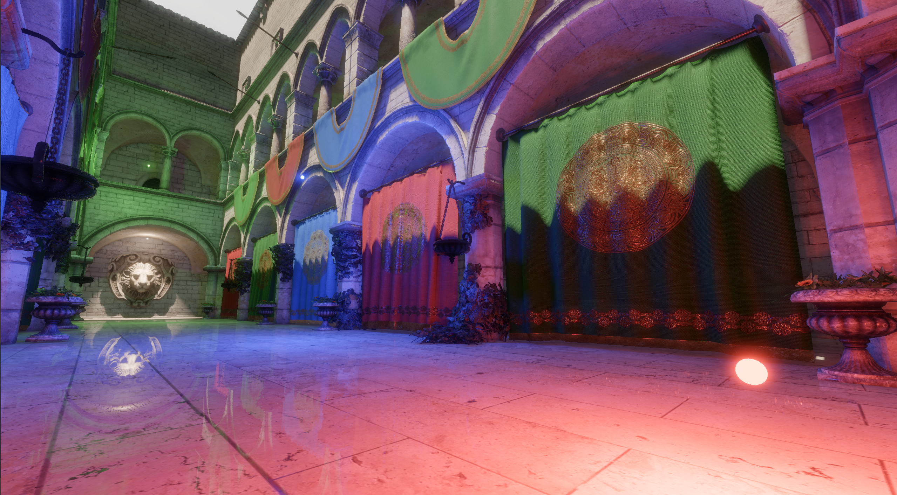
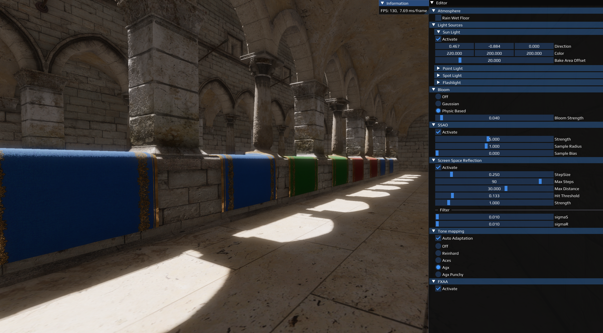
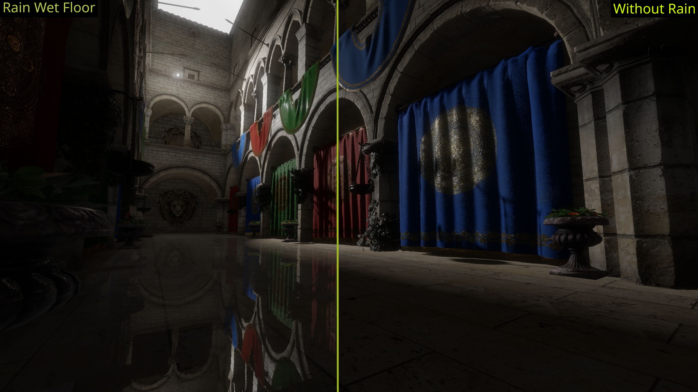
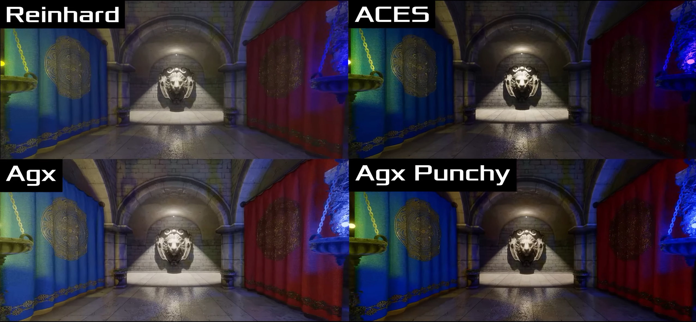

# PBR Sponza

PBR Sponza is a native C++ OpenGL renderer built around the classic Sponza scene. It demonstrates a physically based rendering pipeline with deferred shading, image-based lighting, screen-space effects, HDR tone mapping, bloom, and an ImGui editor for adjusting lighting and post-processing parameters at runtime.

The project is intended as a graphics programming playground: it keeps the renderer, shader code, model loading, and visual effects close enough to inspect and modify while still presenting a complete real-time scene.

## Demo Video

Watch the project showcase on YouTube: [PBR Sponza Demo](https://youtu.be/V9zPx25o9wY)

## Screenshots









## Features

- OpenGL 4.6 core-profile renderer using GLFW and GLAD.
- PBR Sponza asset pipeline with albedo, normal, metallic, and roughness textures.
- Deferred shading with G-buffer generation.
- Image-based lighting baked from HDR environment maps into cubemap, irradiance, prefiltered environment, and BRDF LUT textures.
- Dynamic sun, point, spot, and flashlight controls.
- Directional and cube-map shadow passes.
- SSAO with adjustable strength, radius, and bias.
- Screen-space reflections with bilateral filtering.
- Rain wet-floor mode for a reflective atmosphere test.
- HDR post-processing with Reinhard, ACES, AgX, and AgX Punchy tone mapping.
- Bloom modes, including Gaussian blur and a physically based bloom path.
- FXAA toggle.
- Dear ImGui editor and FPS information window.
- Optional Doxygen documentation generation when Doxygen is available.

## Project Layout

```text
assets/                 Runtime assets copied into the build output
assets/models/          Sponza model and PBR texture set
assets/shaders/         GLSL shaders for geometry, lighting, IBL, shadows, and post-processing
assets/textures/hdr/    HDR environment maps used for IBL baking
src/                    C++ application source
src/imgui/              Bundled Dear ImGui backend and widgets
src/learnopengl/        Camera, model, mesh, DDS loading, bloom, and helper utilities
doxygen/                Doxygen theme support
```

## Dependencies

The project uses Conan and CMake to resolve most native dependencies:

- CMake 3.27 or newer
- Conan 2
- GCC/MinGW with C++23 support
- Ninja
- OpenGL 4.6-capable GPU and driver
- GLAD
- GLFW
- GLM
- stb
- Assimp
- Dear ImGui, bundled in `src/imgui`
- Doxygen, optional

## Build

The project has been tested with the `gcc-default` Conan profile on Windows. The profile should use GCC/MinGW, Ninja, and `libstdc++11`.

Install dependencies with Conan first:

```powershell
conan install . --build=missing -pr:h gcc-default -pr:b gcc-default -s build_type=Release
```

Configure and build the release preset:

```powershell
cmake --preset Release
cmake --build --preset release
```

For a debug build:

```powershell
conan install . --build=missing -pr:h gcc-default -pr:b gcc-default -s build_type=Debug
cmake --preset Debug
cmake --build --preset debug
```

Build output is written under `build/<Config>/bin`. The CMake build copies files from `assets/` into the runtime output directory so the executable can load shaders, models, textures, fonts, and DLLs from expected relative paths.

## Run

After building, run the executable from its output directory:

```powershell
cd build\Release\bin
.\OpenGL_Course_Project.exe
```

## Controls

- `W`, `A`, `S`, `D`: move the camera.
- `Space`: move up.
- `Left Shift`: move down.
- Mouse movement: look around when the cursor is captured.
- Mouse scroll: adjust camera zoom.
- `K`: toggle cursor capture so the ImGui editor can be used comfortably.
- `V`: toggle the swap interval setting.
- `E`: toggle automatic eye adaptation.
- `G` / `H`: decrease or increase height mapping scale.
- `Up` / `Down`: switch between baked IBL environment maps.
- `Esc`: close the application.

## Runtime Editor

The ImGui editor exposes the main rendering controls:

- Rain wet-floor mode.
- Sun, point light, spot light, and flashlight parameters.
- Bloom mode and strength.
- SSAO toggle and sampling parameters.
- Screen-space reflection quality and filtering parameters.
- Tone mapping mode and automatic exposure adaptation.
- FXAA toggle.

## Notes

The default window size is currently fixed at 2560x1440 in `src/Source.cpp`. If the application opens larger than your display, adjust `SCR_WIDTH` and `SCR_HEIGHT` before rebuilding.
